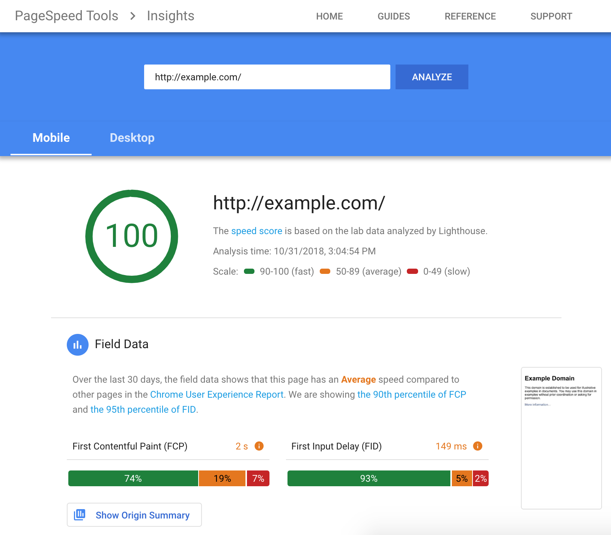
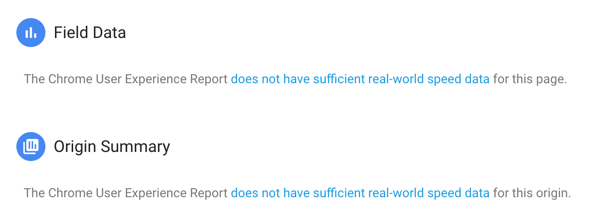

# Using the Chrome UX Report on PageSpeed Insights

[PageSpeed Insights](https://developers.google.com/speed/pagespeed/insights/) 
(PSI) is a tool for web developers to understand what a page's performance is 
and how to improve it. It uses [Lighthouse](https://developers.google.com/web/tools/lighthouse/) 
to audit a given page and identify opportunities to improve performance. It also 
integrates with the Chrome UX Report ([CrUX](https://developers.google.com/web/tools/chrome-user-experience-report/)) 
to show how real users experience performance on the page and the origin in 
aggregate. In this codelab, learn how to use PSI to extract insights from CrUX 
and better understand the user experience.

## Reading the data

To get started, go to [https://developers.google.com/speed/pagespeed/insights/](https://developers.google.com/speed/pagespeed/insights/) 
and enter the URL of the page you want to test. After a few seconds, Lighthouse 
audits will be performed and you will see sections for Field and Lab data. CrUX 
is a collection of real user experiences from the field, while Lighthouse is a 
controlled test in the lab.

In the Field Data section, you'll see two metrics: First Contentful Paint (FCP) 
and First Input Delay (FID). These metrics are representative of the user 
experience in different ways. FCP measures the time until the page displays 
something in the foreground, like some text or a logo. FID measures the 
interactivity of the page, from the user's first interaction to the time the 
page responds to it.

Metric | Fast | Average | Slow
-- | -- | -- | --
FCP | 0 - 1000ms | 1000ms - 2500ms | 2500ms+
FID | 0 - 50ms | 50 - 250ms | 250ms+

This table describes how FCP and FID values are categorized as either fast, 
average, or slow.

There are three ways that the user experience is displayed in PSI:

- a label summarizing the page as fast, average, or slow
- a percentile measured in seconds or milliseconds
- a distribution representing the percent of fast, average, and slow experiences

In the screenshot above, the page has a speed label of "average". To achieve a 
"fast" label, both FCP and FID must be categorized as fast. A page is labelled 
as "slow" if either metric is categorized as slow. All other cases are labelled 
as "average".

A percentile is shown for each metric. For FCP, the 90th percentile is used. 
For FID, it's the 95th percentile. A percentile is a measure used in statistics 
indicating the value below which a given percentage of observations in a group 
of observations fall. For example, the 20th percentile is the value below which 
20% of the observations may be found. Using the screenshot above as an example, 
90% of FCP experiences on this page are 2 seconds or less. Similarly, 95% of FID 
are 149ms or less. These values are also color-coded according to the speed 
label rules, where fast values are green, average values are orange, and slow 
values are red.

Finally, the distributions for each metric are illustrated using the fast, 
average, slow grouping. For example, FCP on this page are "fast" (less than 1 
second) 74% of the time. FID is "slow" (at least 250 milliseconds) 2% of the 
time. These distributions represent the totality of the user experience and 
their shapes indicate the tendency to be either fast or slow.

PSI also includes a summary of origin performance. This is an aggregation of 
user experiences across all pages on an origin. You can get the same FCP and FID 
stats for an entire origin that are available for individual pages. This data is 
closely aligned with what is available on BigQuery, while the page-level 
performance is not made available to query.

There is one major difference between the origin-level performance on PSI versus 
BigQuery. The datasets on BigQuery are released once a month and encompass all 
of the data in the previous calendar month. For example, the 201809 dataset 
includes all user experiences that occurred in September 2018. On the other 
hand, PSI aggregates new data every day encompassing the previous 30 days. So 
the results you see today may be different tomorrow and they would not 
necessarily be the same as what you'd see in the monthly aggregations on 
BigQuery.

If the URL you entered is not available in CrUX, you will see a null response 
like the one above, indicating that there is not enough data. Lab data from 
Lighthouse is still available to give you an approximation of the page's 
performance.

## FAQ

### When would I use PageSpeed Insights as opposed to other tools?

PSI is the only tool that provides page-level performance from real users. It is also the only tool that aggregates on a daily basis, so you can track how performance changes on a more granular basis. Additionally, there is an API (not covered here) for extracting CrUX data programmatically for both the page and origin.

### Are there any limitations to using PageSpeed Insights?

PSI does not give you access to previous aggregations, only the most recent one. So if you want to see historical data, you will need to be actively collecting it or use the monthly aggregations in BigQuery. PSI also only supports two metrics: FCP and FID.

### Where can I learn more about PageSpeed Insights?

Check out the [PSI documentation](https://developers.google.com/speed/docs/insights/v5/about) 
for more info.
