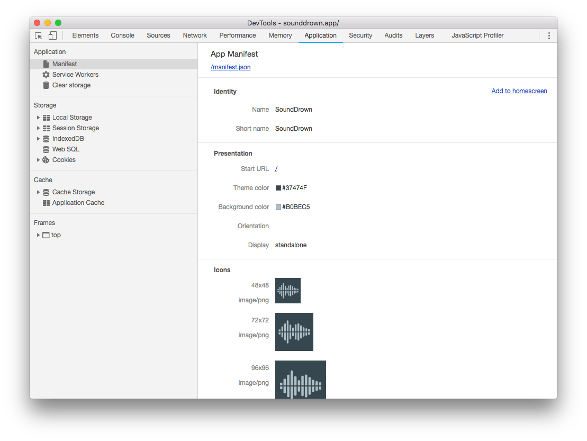

# Add a Web App Manifest

The web app manifest is a simple JSON file that tells the browser about your web
application and how it should behave when 'installed' on the user's mobile
device or desktop. A typical manifest file includes information about the app
name, icons it should use, and the URL that should be opened when the app is
launched.

Manifest files are supported in Chrome, Edge, Firefox, UC Browser, Opera and the
Samsung browser, and Safari is currently working on adding support.

## Create the manifest.json file

The manifest file can have any name, but is commonly named `manifest.json` and
served from the root (your website's top level directory).  

    {
      "short_name": "Weather",
      "name": "Weather - Do I need an umbrella?",
      "description": "Weather forecast information",
      "icons": [
        {
          "src": "/images/icons-192.png",
          "type": "image/png",
          "sizes": "192x192"
        },
        {
          "src": "/images/icons-512.png",
          "type": "image/png",
          "sizes": "512x512"
        }
      ],
      "start_url": "/?source=pwa",
      "background_color": "#3367D6",
      "display": "standalone",
      "scope": "/",
      "theme_color": "#3367D6"
    }

<table>
<thead>
<tr>
<th><strong>Property</strong></th>
<th><strong>Use</strong></th>
</tr>
</thead>
<tbody>
<tr>
<td><code>short_name</code> (required)</td>
<td>Short human-readable name for the application. This is intended for when
there is insufficient space to display the full name of the web
application, like device homescreens.</td>
</tr>
<tr>
<td><code>name</code> (required)</td>
<td>Human-readable name for the site when displayed to the user.</td>
</tr>
<tr>
<td><code>description</code> (recommended)</td>
<td>General description of what the PWA does.</td>
</tr>
<tr>
<td><code>icons</code> (required)</td>
<td>An array of image files that can serve as application icons. Chrome
requires a 192x192px and a 512x512px icon. Additional sizes are optional,
and recommended for those who want to ensure pixel perfect icons.</td>
</tr>
<tr>
<td><code>start_url</code> (required)</td>
<td>The URL that loads when a user launches the application. This has to be a
relative URL, relative to the manifest url.</td>
</tr>
<tr>
<td><code>background_color</code> (recommended)</td>
<td>The background color used on the auto-generated splash screen when the PWA
is launched.</td>
</tr>
<tr>
<td><code>display</code> (required)</td>
<td>The developers' preferred display mode for the PWA.</td>
</tr>
<tr>
<td><code>scope</code> (recommended)</td>
<td>The navigation scope of this website's context. This restricts what web
pages can be viewed while the manifest is applied. If the user navigates
outside the scope, it returns to a normal web page inside a browser
tab/window.</td>
</tr>
<tr>
<td><code>theme_color</code> (recommended)</td>
<td>The default theme color for an application. This affects how the OS
displays the site.  
<ul>
<li>On Android's task switcher, the theme color surrounds the site. </li>
<li>On desktop, the theme color is used to style the title bar.</li>
</ul>
</td>
</tr>
</tbody>
</table>

## Add the web app manifest to your pages

When you have created the manifest, add a `<link>` tag to all the pages of
    your Progressive Web App.

For example:

    <link rel="manifest" href="/manifest.json">

## Test your manifest

To verify your manifest is setup correctly, use the Manifest tab on the 
Application panel of Chrome DevTools.

This tab provides a human-readable version of many of your manifest's
properties, and makes it easy to verify that all of the images are loading
properly.

### Try it

1. Open a new tab to
    [manifest-good.glitch.me](https://manifest-good.glitch.me/).
1. Open Chrome DevTools and switch to the Application panel, then the
    Manifest tab

## Further reading

There are several additional properties that can be added to the web app
manifest, refer to the
[MDN Web App Manifest documentation](https://developer.mozilla.org/en-US/docs/Web/Manifest)
for full details.
