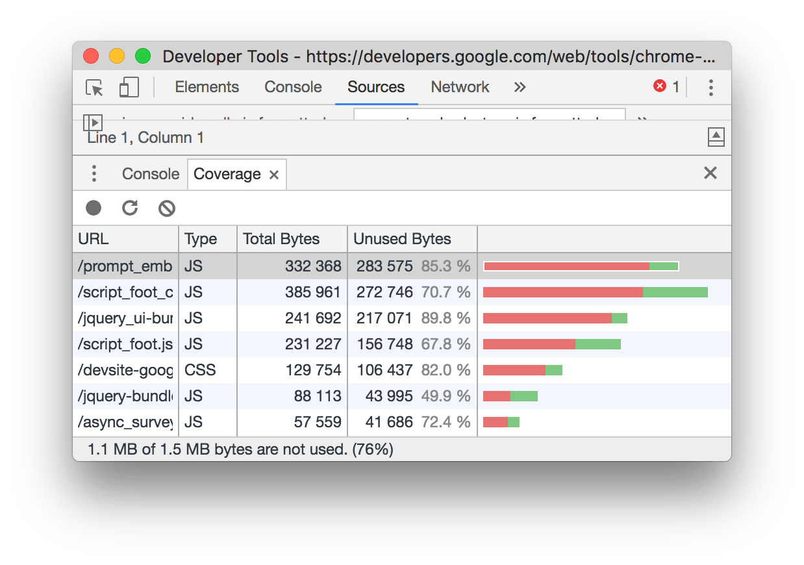

# Remove unused code

Registries like [npm](https://docs.npmjs.com/getting-started/what-is-npm) have
transformed the JavaScript world for the better by allowing anyone to easily
download and use over _half a million_ public packages. But we often include
libraries we're not fully utilizing. To fix this issue, **analyze your bundle**
to detect unused code. Then remove **unused** and **unneeded** libraries. 

## Analyze your bundle

The simplest way to see the size of all network requests is to open the
**Network** panel in DevTools, check `Disable Cache`, and reload the page.


The [Coverage](https://developers.google.com/web/updates/2017/04/devtools-release-notes#coverage)
tab in DevTools will also tell you how much CSS and JS code in your application
is unused.



By specifying a full Lighthouse configuration through its Node CLI, an "Unused
JavaScript" audit can also be used to trace how much unused code is being
shipped with your application.


If you happen to be using [webpack](https://webpack.js.org/) as your bundler,
[Webpack Bundle Analyzer](https://github.com/webpack-contrib/webpack-bundle-analyzer)
will help you investigate what makes up the bundle. Include the plugin in your
webpack configurations file like any other plugin: 

<pre class="prettyprint">
module.exports = {
  //...
  plugins: [
    //...
    <strong>new BundleAnalyzerPlugin()</strong>
  ]
}
</pre>

Although webpack is commonly used to build single-page applications, other
bundlers, such as [Parcel](https://parceljs.org/) and
[Rollup](https://rollupjs.org/guide/en), also have visualization tools that you
can use to analyze your bundle. 

Reloading the application with this plugin included shows a zoomable treemap of
your entire bundle.


Using this visualization allows you to inspect which parts of your bundle are
larger than others, as well as get a better idea of all the libraries that
you're importing. This can help identify if you are using any unused or
unnecessary libraries.

## Remove unused libraries

In the previous treemap image, there are quite a few packages within a single
`@firebase` domain. If your website only needs the firebase database component,
update the imports to fetch that library: 

<pre class="prettyprint">
<s>import firebase from 'firebase';</s>
<strong>import firebase from 'firebase/app';</strong>
<strong>import 'firebase/database';</strong>
</pre>

It is important to emphasize that this process is significantly more complex for
larger applications. 

For the mysterious looking package that you're quite sure is not being used
anywhere, take a step back and see which of your top-level dependencies are
using it. Try to find a way to only import the components that you need from it.
If you aren't using a library, remove it.  If the library isn't required for the
initial page load, consider if it can be [lazy loaded](/path/fast/reduce-javascript-payloads-with-code-splitting).

## Remove unneeded libraries

Not all libraries can be easily broken down into parts and selectively imported.
In these scenarios, consider if the library should be removed entirely for a
simpler alternative. 

For example, instead of importing an entire date utility library like
[moment](https://momentjs.com/) to parse and format a single date, you can
consider writing your own function that calculates an age in weeks given a Unix
timestamp:

```
const ageInWeeks = birthDate => {
  const WEEK_IN_MILLISECONDS = 1000 * 60 * 60 * 24 * 7;
  const diff = Math.abs((new Date).getTime() - birthDate);

  return Math.floor(diff / WEEK_IN_MILLISECONDS);
}
```

Although this approach reduces unnecessary code from the `moment` library,
larger applications can be significantly more complicated. What if other parts
of the application involve time zones and different locales? Or what if there
are more complicated date manipulations? Manipulating and parsing dates and
times can quickly become confusing, and `moment` simplifies this
significantly.

When using third-party dependencies, building a custom solution or leveraging a
lighter alternative are options worth considering.  Always weigh the complexity
and effort required for either of these before removing a library entirely from
an application.
