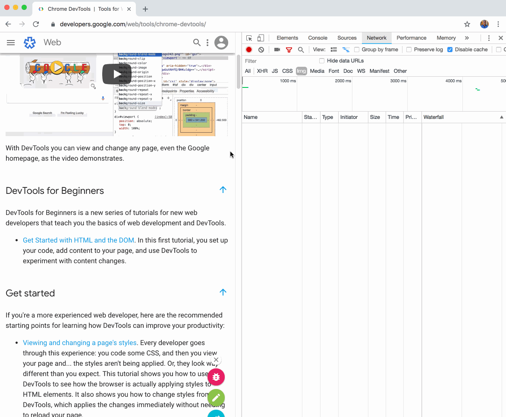

# Use lazysizes to lazyload images

**Lazy loading** is the strategy of loading resources as they are needed, rather
than in advance. This approach frees up resources during the initial page load
and avoids loading assets that are never used. 

If you've ever used sites like Spotify or Medium, you've probably experienced
this firsthand. Dining in a restaurant is a good example of lazy loading: the
restaurant brings out your courses as you are ready for them, rather than
dumping them on you all at once.

_Lazy loading in action_

[lazysizes](https://github.com/aFarkas/lazysizes) is the most popular library
for lazy loading images. It is a script that intelligently loads images as the
user moves through the page and prioritizes images that the user will encounter
soon. `lazysizes` is a good choice because it uses the highly performant
[Intersection Observer API](https://developer.mozilla.org/en-US/docs/Web/API/Intersection_Observer_API)
(where available) to detect the visibility of page elements. This makes it more
performant than older solutions that use approaches like event handlers.

## Add lazysizes

It is simple to add lazysizes:

+  Add the lazysizes script to your pages.
+  Choose the images you want to lazy-load.
+  Update image tags for those images.

### Add the lazysizes script

Add the lazysizes
[script](https://github.com/aFarkas/lazysizes/blob/gh-pages/lazysizes.min.js) to
your pages:

    
### Update image tags

| Before  | After |
|---------|----------------|
| `` | `data-src</strong>="flower.jpg" <strong>class="lazyload"</strong>>` |

When you update the image tags you make two changes:

+  **Add the "lazyload" class**: This indicates to lazysizes that the
    image should be lazy loaded.
+  **Change the "src" attribute to "data-src"**: When it is time to load the
    image, the lazysizes code sets the image "`src`" attribute using the value
    from the "`data-src`" attribute.

## Verify

Once you've added lazysizes to a page, you can see it in action by opening
DevTools and scrolling down the page. As you scroll, you should see new network
requests occur and   tag classes change from "lazyload" to "lazyloaded."

Additionally, you can use Lighthouse to verify that you haven't forgotten to
lazy load any offscreen images. Run the Lighthouse performance audit (Lighthouse
> Options > Performance) and look for the results of the "Defer offscreen
images" audit.

## See it in action

Walk through a step-by-step guide that uses lazysizes to lazyload images:

+  [Lazyload offscreen images with lazysizes](http://www.example.com)

## 
