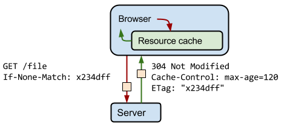

# The HTTP cache: your first line of offense

The browser's HTTP cache is your first line of offense. It's not necessarily the
most powerful or flexible approach, and you have limited control over the
lifetime of cached response. But there are several rules of thumb that give you
a sensible caching implementation without much work, so you should always try to
follow them.

The HTTP cache's behavior is controlled by a combination of
[request](https://developer.mozilla.org/en-US/docs/Glossary/Request_header) and
[response](https://developer.mozilla.org/en-US/docs/Glossary/Response_header)
headers. In an ideal scenario, you'll have control over both the code for your
web application (which will determine the request headers) and your web server's
configuration (which will determine the response headers).

## Request headers: stick with the defaults (usually)

While there are a number of important headers that should be included in your
web app's outgoing requests, the browser almost always takes care of setting
them on your behalf when it makes requests. Request headers that affect checking
for freshness, like
`[If-None-Match](https://developer.mozilla.org/en-US/docs/Web/HTTP/Headers/If-None-Match)`
and
`[If-Modified-Since](https://developer.mozilla.org/en-US/docs/Web/HTTP/Headers/If-Modified-Since)`
just appear based on the browser's understanding of the current values in the
HTTP cache.

This is good news—it means that you can continue including tags like `` in your HTML, and the browser  automatically takes care of
HTTP caching for you, without extra effort.

**Note:** Developers who do need more control over the HTTP cache in their web
application have an alternative—you can "drop down" a level, and manually use
the [Fetch API](https://developer.mozilla.org/en-US/docs/Web/API/Fetch_API),
passing it 
`[Request](https://developer.mozilla.org/en-US/docs/Web/API/Request)` objects
with specific
`[cache](https://developer.mozilla.org/en-US/docs/Web/API/Request/cache)`
overrides set. That's beyond the scope of this guide, though!

## Response headers: configure your web server

The part of the HTTP caching setup that matters the most is the headers that
your web server adds to each outgoing response. A combination of the
`[Cache-Control](https://developer.mozilla.org/en-US/docs/Web/HTTP/Headers/Cache-Control)`,
`[ETag](https://developer.mozilla.org/en-US/docs/Web/HTTP/Headers/ETag)`, and
`[Last-Modified](https://developer.mozilla.org/en-US/docs/Web/HTTP/Headers/Last-Modified)`
headers all factor into effective caching behavior.

Some web servers have built-in support for setting those headers by default,
while others leave the headers out entirely unless you explicitly configure
them. The specific details of _how_ to configure headers varies greatly
depending on which web server you use, and you should consult the relevant
documentation to get the most accurate details.

To save you some searching, here are instructions on configuring a few popular
web servers:

+  [Express](https://expressjs.com/en/api.html#express.static), running
    on Node.js
+  [Apache](https://httpd.apache.org/docs/2.4/caching.html)
+  [nginx](http://nginx.org/en/docs/http/ngx_http_headers_module.html)
+  [Firebase Hosting](https://firebase.google.com/docs/hosting/full-config)
+  [Netlify](https://www.netlify.com/blog/2017/02/23/better-living-through-caching/)

Leaving out the Cache-Control response header does not disable HTTP caching!
Instead, browsers
[effectively guess](https://www.mnot.net/blog/2017/03/16/browser-caching#heuristic-freshness)
what type of caching behavior makes the most sense for a given type of content.
Chances are you want more control than that offers, so take the time to
configure your response headers.

## Which response header values should you use?

There are two important scenarios that you should cover when configuring your
web server's response headers.

### Long-lived caching for versioned URLs

When responding to requests for URLs that contain
"[fingerprint](https://en.wikipedia.org/wiki/Fingerprint_(computing))" or
versioning information, and whose contents are never meant to change, add
`Cache-Control: max-age=31536000` to your responses.

Setting this value tells the browser that when it needs to load the same URL
anytime over the next one year (31,536,000 seconds; the maximum supported
value), it can immediately use the value in the local HTTP cache, without having
to make a network request to your web server at all. That's great—you've
immediately gained the reliability and speed that comes from avoiding the
network!

Build tools like webpack can
[automate the process](https://webpack.js.org/guides/caching/#output-filenames)
of assigning hash fingerprints to your web app assets' URLs.

### Server revalidation for unversioned URLs

Unfortunately, not all of the URLs you load are versioned. Maybe you're not able
to include a build step prior to deploying your web app, so you can't add hashes
to your asset URLs. And every web application needs HTML files—those files are
(almost!) never going to include versioning information, since no one will
bother using your web app if they need to remember that the URL to visit is
`https://example.com/index.34def12.html`. So what can you do for those URLs?

This is one scenario in which you need to admit defeat. HTTP caching alone isn't
powerful enough to avoid the network completely. (Don't worry—you'll soon learn
about service workers, which will provide the support we need to swing the
battle back in your favor.) But there are a few steps you can take to make sure
that network requests are as quick and efficient as possible.

First off, make sure you add `Cache-Control: no-cache` to your response
messages. This explicitly tells the browser that you've surrendered, and that
going to the network to check if there's been an update is necessary. 

Along with that, setting one of two additional response headers is recommended:
either
`[Last-Modified](https://developer.mozilla.org/en-US/docs/Web/HTTP/Headers/Last-Modified)`
or `[ETag](https://developer.mozilla.org/en-US/docs/Web/HTTP/Headers/ETag)`.
ETags are identifiers for specified resources. They allow caches to be more
efficient and are useful to help prevent simultaneious updates from overwriting
each other.  By setting one or the other of those headers, you'll end up making
the revalidation request much more efficient. They end up triggering the
`[If-Modified-Since](https://developer.mozilla.org/en-US/docs/Web/HTTP/Headers/If-Modified-Since)`
or
`[If-None-Match](https://developer.mozilla.org/en-US/docs/Web/HTTP/Headers/If-None-Match)`
request headers that we mentioned earlier.

When a properly configured web server sees those incoming request headers, it
can confirm whether the version of the resource that the browser already has in
its HTTP cache matches the latest version on the web server. If there's a match,
then the server can respond with an
`[304 Not Modified](https://developer.mozilla.org/en-US/docs/Web/HTTP/Status/304)`
HTTP response, which is the equivalent of "Hey, keep using what you've already
got!" There's very little data to transfer when sending this type of response,
so it's usually much faster than having to actually send back a copy of the
actual resource being requested.

## Dig deeper

If you're looking to go beyond the basics of using the `Cache-Control` header,
the best guide out there is Jake Archibald's
"[Caching best practices & max-age gotchas](https://jakearchibald.com/2016/caching-best-practices/)."

Fore most developers, though, just choosing between `Cache-Control: no-cache` or
`Cache-Control: max-age=31536000` should be fine.
